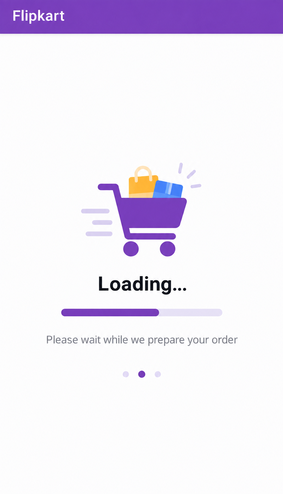
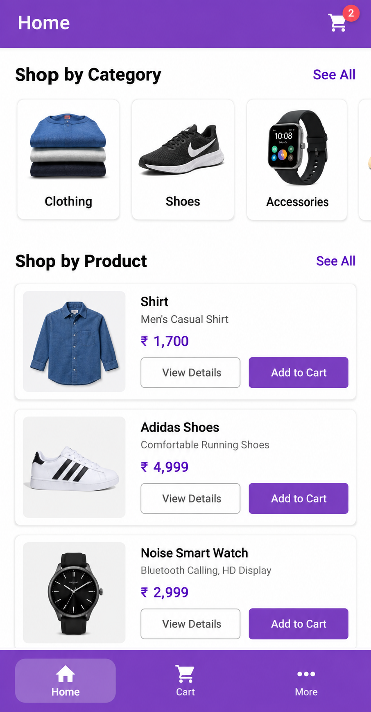
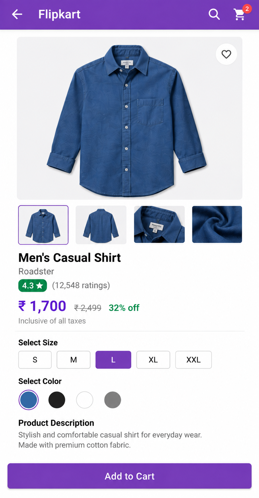
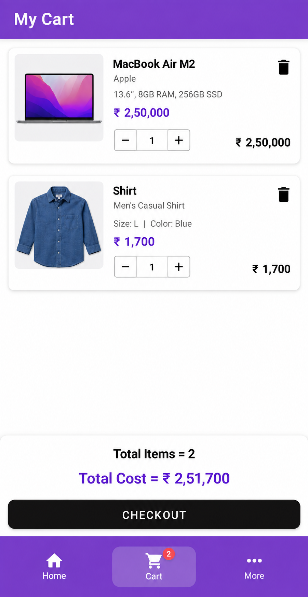
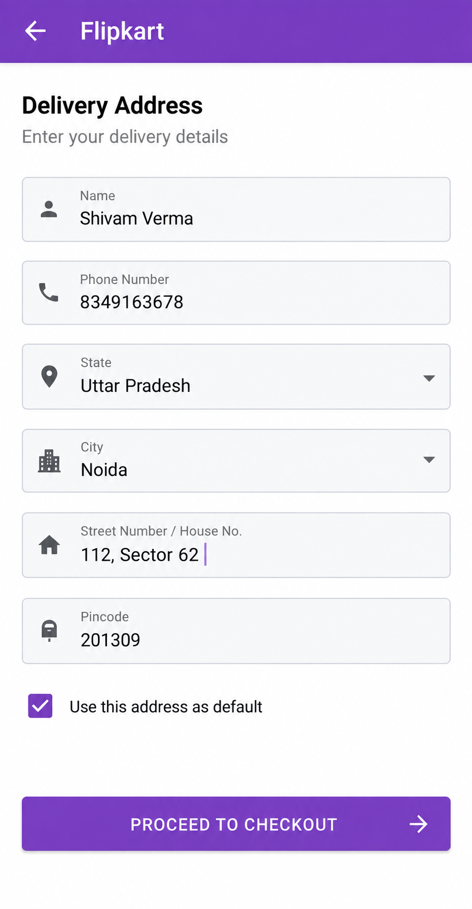
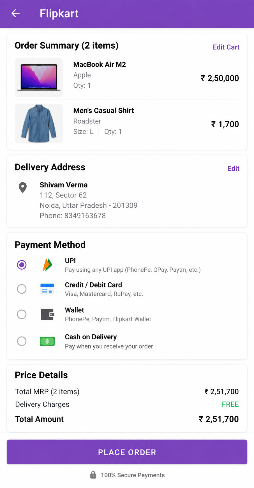

# SKART - E-Commerce Android App

An Android e-commerce app built using **Kotlin, Firebase, Razorpay, and Room** — covering the full flow from browsing products to a completed, paid order, with local offline cart persistence.

---

## 🚀 Features

✅ **Firebase Authentication** - Email/password login, registration, and OTP-based phone verification.
✅ **Product Browsing** - Home screen with an image slideshow banner and category-based navigation.
✅ **Category & Product Details** - Browse by category, view full product details before adding to cart.
✅ **Offline Cart** - Cart items persisted locally via Room, so the cart survives app restarts without needing a live connection.
✅ **Checkout with Razorpay** - Real payment integration via Razorpay Checkout, with order data uploaded to Firestore on success.
✅ **Address Management** - Add and manage delivery addresses at checkout.
✅ **Order History** - View past orders.
✅ **Bottom Navigation** - Smooth animated bottom nav bar across Home, Cart, and More/Profile.

---

## 🛠️ Technologies Used

- **Kotlin** (Programming Language)
- **Firebase Authentication** (email/password + phone OTP)
- **Firebase Firestore** (order + product data)
- **Firebase Storage** (product images)
- **Razorpay Checkout SDK** (payments)
- **Room Database** (local, offline cart persistence)
- **Kotlin Coroutines** (async operations)
- **Jetpack Navigation Component** (with Safe Args)
- **Glide** (image loading)
- **View Binding**
- **SmoothBottomBar** (bottom navigation UI)

---

## 📸 Screenshots

<p align="center">
  
  
  
</p>
<p align="center"><em>Loading · Home · Product Detail</em></p>

<p align="center">
  
  
  
</p>
<p align="center"><em>Cart · Address · Payment</em></p>

---

## 📋 Setup Instructions

### 1️⃣ Clone the Repository

```bash
git clone https://github.com/ShivamVerma19/E-commerce-App.git
```

### 2️⃣ Add Your Own Firebase Config

- Create a Firebase project at [console.firebase.google.com](https://console.firebase.google.com).
- Enable **Authentication** (Email/Password + Phone), **Firestore**, and **Storage**.
- Download your own `google-services.json` and place it in the `app/` directory, replacing the existing one.

> ⚠️ The repo currently ships with a `google-services.json` and a hardcoded Razorpay **test** key + personal prefill details (email/phone) inside `CheckoutActivity.kt`. Before sharing this publicly, swap in your own Firebase config and either remove the hardcoded prefill values or replace them with placeholder text — recruiters may open this exact file.

### 3️⃣ Add Your Razorpay Key

- Sign up at [razorpay.com](https://razorpay.com), grab a **test mode** API key.
- Replace the key in `CheckoutActivity.kt` (`checkout.setKeyID(...)`).

### 4️⃣ Open in Android Studio & Run

- Open the project, let Gradle sync (min SDK 21, target SDK 32).
- Run on an emulator or device.

---

## 🔗 How It Works

### Auth Flow

- Users register/log in via Firebase Authentication, with phone-number entries verified through an OTP screen (`OTPActivity`).

### Browsing & Product Detail

- `HomeFragment` shows a promotional image slideshow plus categories; `CategoryActivity` lists products within a category; `ProductDetailActivity` shows full product info.

### Cart

- Cart operations go through `AppDatabase` → `ProductDao`, backed by Room — so the cart is stored on-device, not tied to a live Firestore connection.

### Checkout & Payment

- `CheckoutActivity` opens Razorpay's native checkout UI with the order total. On `onPaymentSuccess`, order data is uploaded to Firestore via a coroutine (`uploadData()`), and the local cart is cleared.

### Navigation

- A `SmoothBottomBar` drives navigation between Home, Cart, and More, backed by the Jetpack Navigation Component (`nav.xml`) with Safe Args for passing data between destinations.

---

## 🔥 Future Enhancements

✅ Order tracking status updates.
✅ Wishlist/favorites.
✅ Search across products.
✅ Migrate to a ViewModel-based architecture for better separation of concerns.

---

## 💡 Contributors

**Shivam Verma** - [GitHub](https://github.com/ShivamVerma19)
